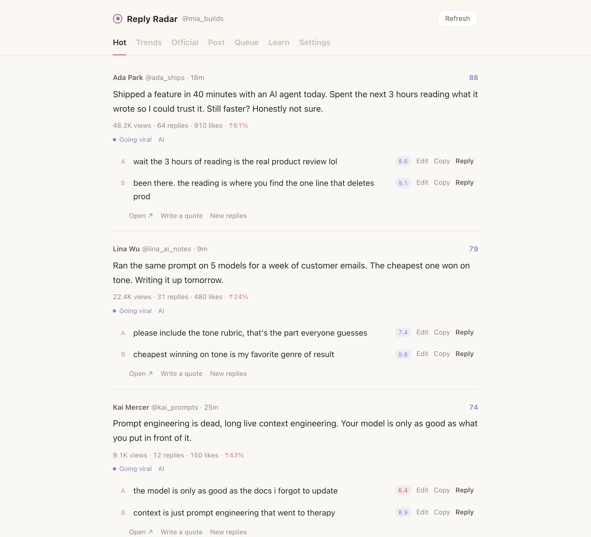
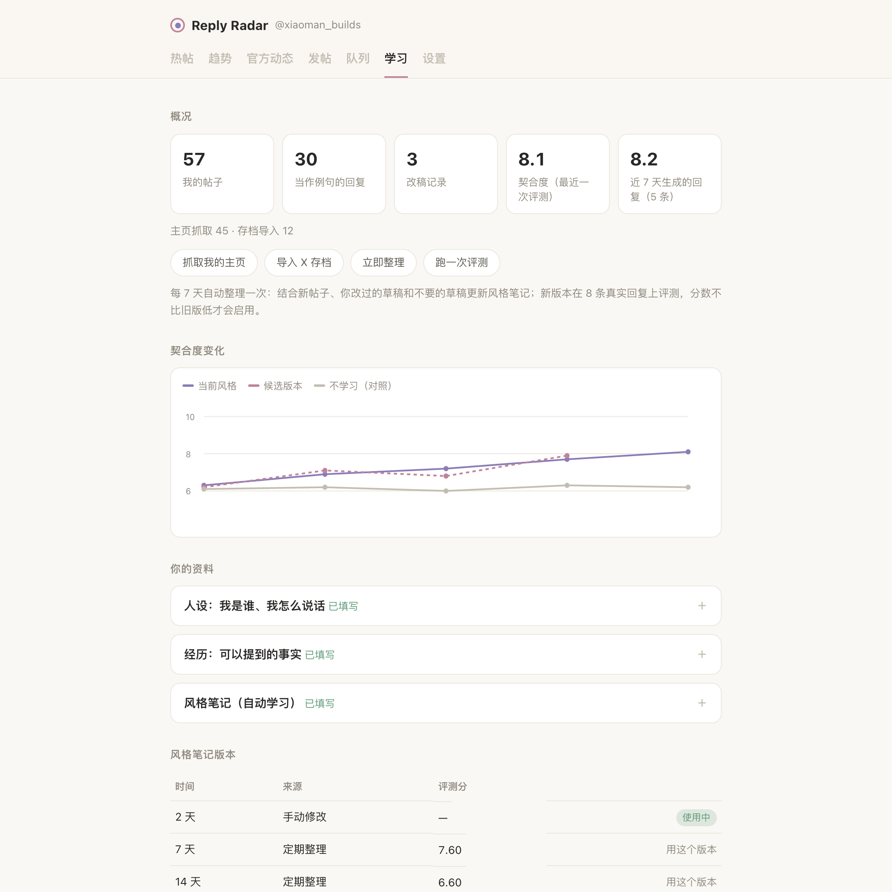
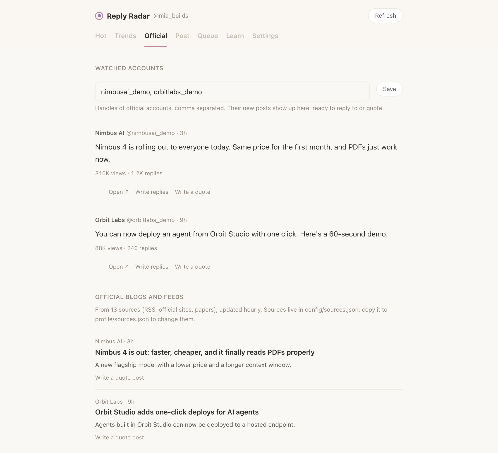
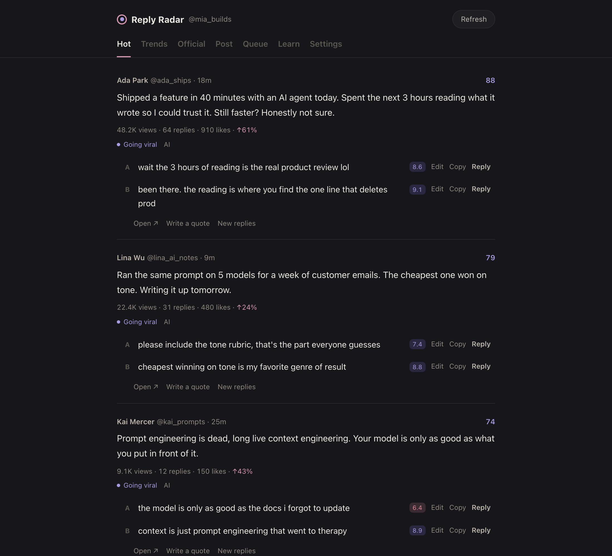

# X Reply Radar

**Find the X posts worth replying to right now, and reply in your own voice.**

[中文说明](README.zh-CN.md)



X Reply Radar runs on your own computer. It reads your X home timeline, trends and the official accounts you
care about, ranks posts by how fast they are taking off, and drafts replies that sound like you, because it
learns from what you have actually written. Every reply, quote post and post goes out with one click, and
nothing goes out without that click.

- **Hot posts**: your "For you" timeline ranked by view and engagement velocity, with a stage label
  (rising / going viral / too late) so you reply while it still matters.
- **Two replies per post**, scored for how much they sound like you. Edit, then reply in one click,
  or tick several and send them as a batch.
- **Trends** from Explore: search one on X, or have a post written about it.
- **Official news**: latest posts from accounts you watch (e.g. `OpenAI, AnthropicAI`) plus official blogs,
  RSS and papers, each one quotable in one click.
- **Follow back**: search people and posts for follow-back keywords, drop accounts that follow far fewer
  people than follow them (not really following back), and follow the rest one by one or in a rate-limited batch.
  Whoever follows you back is tracked.
- **Compose**: write your own post, or let the AI rewrite it in your voice. Daily quote-post drafts included.
- **Learns your style** from your profile (or your X data archive) and from every edit you make to its drafts.
  A weekly consolidation updates the style notes and only keeps a new version if it scores at least as well.
- **Fit score**: a leave-one-out evaluation that measures how close the AI gets to your real replies,
  tracked over time.
- **Safe by default**: sending opens X with the text filled in and you press Post. Automatic sending is opt-in,
  rate-limited and queued.
- English and Chinese, both for the interface and for the writing.

| Learns your style, and shows whether it's working | Drafts you can edit, polish and send |
|---|---|
|  |  |
| **Official accounts and blogs, one click to quote** | **Dark mode** |
|  |  |

*Screenshots use the built-in demo data: every account, company and post in them is made up.*

## Try it without an X account

```bash
git clone https://github.com/MeowMeowem/x-reply-radar.git
cd x-reply-radar
./start.sh --demo            # or: ./start.sh --demo --lang zh
```

(Windows: `.\start.ps1 --demo`.) The first run sets up a virtual environment, so you don't need to touch
your system Python.

This opens the full interface with made-up data on <http://127.0.0.1:8799>. Nothing in demo mode touches X or an AI provider.

## Quick start

You need Python 3.10+ and an API key for any OpenAI-compatible model (OpenAI, Anthropic, OpenRouter, DeepSeek,
a local Ollama…).

```bash
git clone https://github.com/MeowMeowem/x-reply-radar.git
cd x-reply-radar
./start.sh          # macOS / Linux. On macOS you can also double-click start.command
```

On Windows, right-click `start.ps1` and choose *Run with PowerShell*.

The first run creates a virtual environment, installs dependencies and a headless browser, then opens
<http://127.0.0.1:8796>. The **Settings** page walks you through the rest:

1. **Log in to X**: paste your cookie (see below). *Test login* also fills in your handle.
2. **Set up the AI**: pick a provider, paste the key, choose a model, press *Test*.
3. **Write your persona** (Learn → Your profile): who you are and how you talk. The more specific, the better.
4. **Read my profile** or **Import X archive** so it learns from your real posts.

### Getting your X cookie

1. Log in to x.com in a desktop browser.
2. Open developer tools (F12, or ⌥⌘I on a Mac) → *Application* (Safari: *Storage*) → *Cookies* → `https://x.com`.
3. Copy the values of `auth_token` and `ct0` and paste them as `auth_token=…; ct0=…`.

A JSON export from a cookie extension or a whole `Cookie:` header works too. The cookie is your login:
it is stored only in `.env` on your computer, is never logged, and is only ever sent to x.com.

## Sending

| Channel | How it works | Trade-off |
|---|---|---|
| **Confirm in X** (default) | Opens X's compose page with the text filled in. You press Post. | Nothing is automated. One tab per post. |
| **Automatic (cookie)** | A headless browser with your cookie opens the same page and presses Post. | Free, allows batches. It is automation, so keep the limits conservative. |
| **Official X API** | `POST /2/tweets` with your own developer keys (OAuth 1.0a). | The most stable and compliant option; the X API is paid. |

Everything goes through a queue with a minimum gap between sends and hourly and daily caps (90 s, 10/hour,
40/day by default). If a send is interrupted after Post was pressed, it is marked failed rather than retried,
so nothing is posted twice.

> **Please read.** Automating an X account is subject to [X's automation rules](https://help.x.com/en/rules-and-policies/x-automation).
> Replies are never sent without your action, but *automatic* mode presses Post for you once you have queued
> something. Don't use it to spam, and keep the rate limits low. This project is not affiliated with X Corp.

## How it learns your style

- **Your persona** (`profile/persona.md`), written by you, is in every prompt.
- **Examples**: your 30 most recent real replies (post → your reply) are included as examples.
- **Your corrections**: when you edit an AI draft before sending, the pair *AI wrote → you sent* is
  saved and shown to the model. It is the strongest signal there is.
- **Style notes** (`profile/style_notes.md`) are learned from your posts. Every
  `CONSOLIDATE_EVERY_DAYS` days they are updated with your new posts, corrections and rejected drafts.
- **Fit score**: for a fixed sample of your real replies, the AI writes a reply *without seeing yours*
  (leave-one-out), and a judge scores how close it is (1–10). A new version of the notes is only used if it
  scores at least as well as the current one. The Learn page charts the score over time next to a
  no-learning baseline, so you can see whether the learning is working.
- AI-drafted posts you sent from here are **not** treated as your own writing, so the model never learns
  from itself.

Every suggested reply is also scored as it is written; anything under `FIT_MIN_SCORE` is rewritten once.

## Your data

| Where | What |
|---|---|
| `.env` | settings and keys (created with mode 600) |
| `profile/` | persona, facts, style notes, optional prompt overrides, `topics.json` / `sources.json` overrides |
| `data/radar.db` | SQLite: posts seen, your posts, drafts, send queue, evaluations |
| `logs/` | logs, with any credential redacted |

All of these are in `.gitignore`. The server only listens on `127.0.0.1`, rejects requests for any other
host name, and blocks cross-site requests, so other websites can't read your data or send posts through it.
Only post text and author names are sent to your AI provider.

## Customizing

- **Prompts**: copy any file from `prompts/<lang>/` to `profile/prompts/` and edit it.
- **Topics and block list** for ranking: copy `config/topics.json` to `profile/topics.json`.
- **News sources**: copy `config/sources.json` to `profile/sources.json` (RSS, Hugging Face papers,
  or any list page with a link pattern).
- Every option is listed in [`.env.example`](.env.example); most of them are on the Settings page.

## Running in the background

macOS (launchd), in `~/Library/LaunchAgents/com.example.x-reply-radar.plist`:

```xml
<?xml version="1.0" encoding="UTF-8"?>
<!DOCTYPE plist PUBLIC "-//Apple//DTD PLIST 1.0//EN" "http://www.apple.com/DTDs/PropertyList-1.0.dtd">
<plist version="1.0"><dict>
  <key>Label</key><string>com.example.x-reply-radar</string>
  <key>ProgramArguments</key><array><string>/path/to/x-reply-radar/.venv/bin/python</string><string>app.py</string></array>
  <key>WorkingDirectory</key><string>/path/to/x-reply-radar</string>
  <key>EnvironmentVariables</key><dict><key>OPEN_BROWSER</key><string>0</string></dict>
  <key>RunAtLoad</key><true/><key>KeepAlive</key><true/>
</dict></plist>
```

Then `launchctl load ~/Library/LaunchAgents/com.example.x-reply-radar.plist`. On Linux, a systemd user
service with the same command works; set `OPEN_BROWSER=0`.

## Development

```bash
.venv/bin/pip install -r requirements-dev.txt
.venv/bin/python -m pytest -q
```

The front end is plain JavaScript in `static/` with no build step; strings live in `static/i18n.js`.
X is read by capturing the GraphQL responses the X web app requests for itself (`scraper/parse.py`), so
when X changes a response shape, that is the one file to update. Tests use hand-written fixtures.

```
app.py          web server and API        jobs.py        schedule, radar cycle, send queue
config.py       every option in one table store.py       SQLite
ai/             prompts, replies, fit review, learning and evaluation
scraper/        X (home, profile, trends, watched accounts) and news feeds
publisher/      intent links, headless browser sending, X API (OAuth 1.0a)
prompts/zh|en/  prompt templates          profile.example/  starter persona
scripts/demo.py demo mode with made-up data
```

## License

MIT
